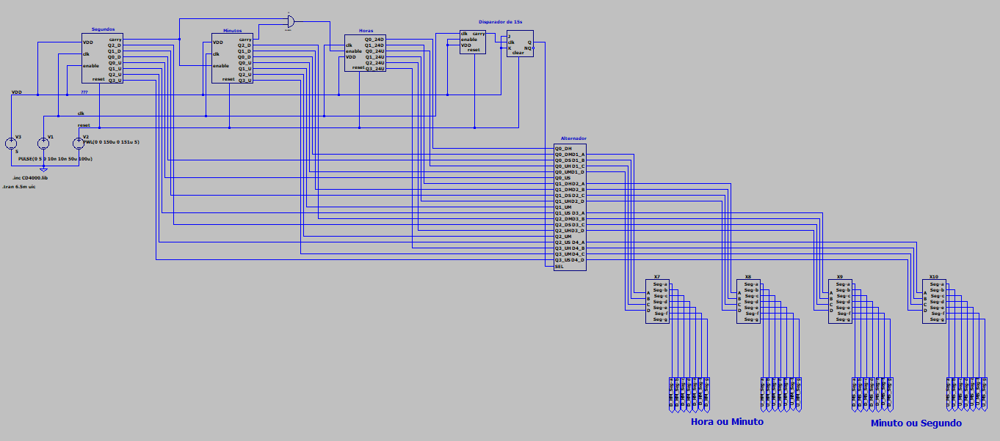
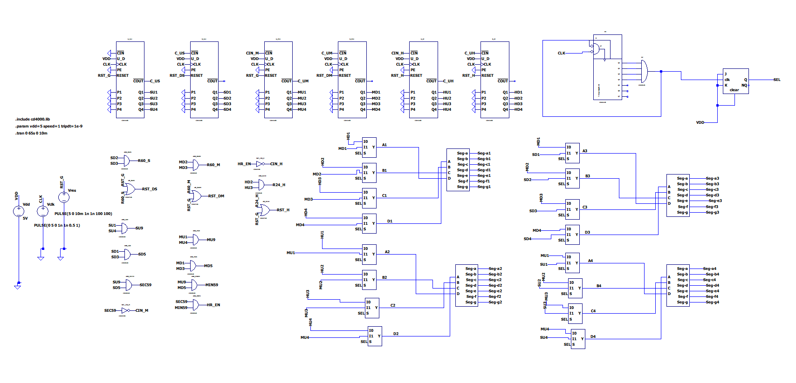
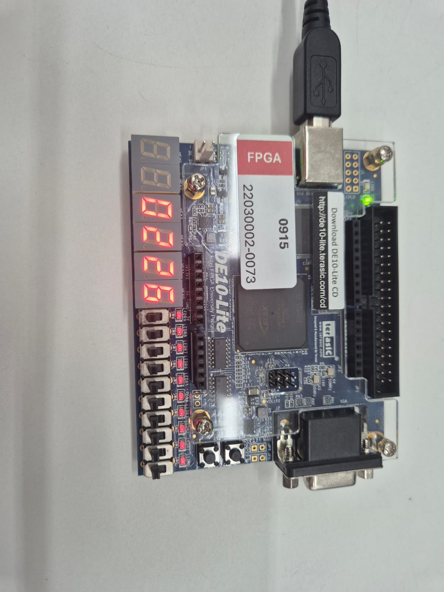
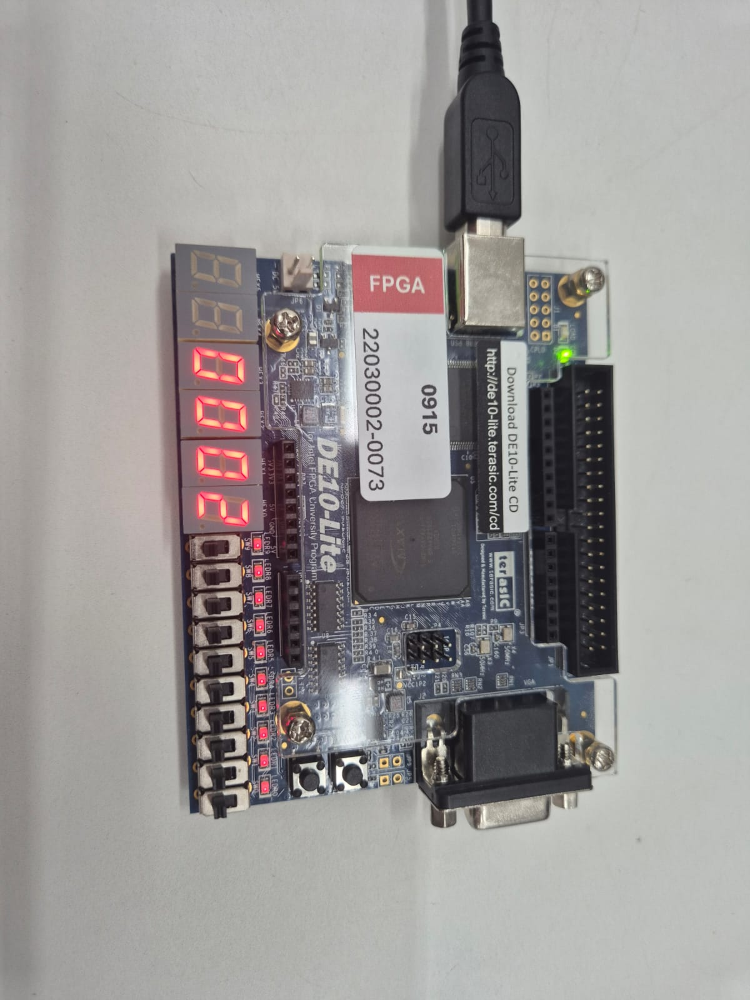

# ⏱️ Relógio Digital Síncrono — CMOS & Verilog

> Implementação de um relógio digital síncrono com exibição de horas, minutos e segundos, alternando os displays a cada 15 segundos. Desenvolvido em três abordagens distintas: lógica discreta CMOS, contadores comerciais CMOS e descrição de hardware em Verilog com síntese em FPGA.

---

## 🏫 Informações Acadêmicas

| | |
|---|---|
| **Instituição** | Universidade Federal do Amazonas (UFAM) |
| **Faculdade** | Faculdade de Tecnologia (FT) |
| **Departamento** | Eletrônica e Computação (DTEC) |
| **Disciplina** | Eletrônica Digital II e Laboratório de Eletrônica Digital |
| **Professor** | Prof. Dr. Thiago Brito |
| **Ano** | 2026 |

**Equipe:**
- João Pedro Felipe Dantas
- Larissa Rafaela Ribeiro de Souza
- Paulo Lucas Tarola Moreira

---

## 📋 Sobre o Projeto

O sistema exibe dois dígitos por vez, alternando automaticamente entre **Hora:Minuto** e **Minuto:Segundo** a cada 15 segundos. A arquitetura é composta por quatro estágios principais:

- **Base de contagem de tempo** — contadores Módulo-60 (segundos e minutos) e Módulo-24 (horas) em BCD
- **Temporizador de alternância** — contador Módulo-15 com Flip-Flop JK em modo toggle
- **Multiplexação** — sinal SEL roteia os dados BCD corretos para os displays
- **Decodificação BCD → 7 segmentos** — saída visual para displays de catodo comum

---

## 🗂️ Estrutura do Repositório

```
📁 relogio-digital-sincrono/
├── 📁 q1-relogio-portas-logicas/        ← LTSpice com lógica discreta CMOS
├── 📁 q2-relogio-contadores-comerciais/ ← LTSpice com CIs comerciais CMOS
├── 📁 q3-relogio-verilog/               ← Código HDL + Testbench + síntese FPGA
├── 📁 imagens/
└── README.md
```

---

## 🔧 Implementações

### Questão 1 — Portas Lógicas Discretas (LTSpice)

Abordagem *bottom-up* utilizando exclusivamente portas lógicas da família CMOS 4000:

- **Flip-Flop JK** construído a partir de portas NAND/AND/OR/NOT — base de todos os contadores
- **Contador Módulo-60** (segundos e minutos): Módulo-10 em cascata com Módulo-6
- **Contador Módulo-24** (horas): lógica de truncamento ao atingir o valor 23
- **Contador Módulo-15**: gera o pulso de alternância a cada 15 segundos
- **Multiplexador 4 bits** e **Decodificador BCD → 7 segmentos** implementados com portas lógicas



---

### Questão 2 — Contadores Comerciais CMOS (LTSpice)

Evolução da arquitetura substituindo a lógica discreta por CIs de Média Escala de Integração (MSI) da família CMOS. O esforço de projeto migrou da criação dos elementos de memória para o desenvolvimento da *glue logic* — as portas lógicas externas responsáveis por interligar os CIs, definir os módulos de contagem e garantir o sincronismo do sistema.



---

### Questão 3 — Verilog + FPGA DE10-Lite (ModelSim + Quartus)

Transcrição da arquitetura da Questão 2 para HDL Verilog, seguindo uma abordagem hierárquica com cada componente modelado em arquivo separado e integrado em um módulo de topo. O projeto inclui um divisor de frequência para adequar o clock da FPGA à base de tempo de 1 Hz do relógio.

A validação lógica foi realizada via simulação no **ModelSim**, com um testbench que acelera o tempo de simulação para verificar o ciclo completo de 24 horas. Após validação, o projeto foi sintetizado no **Intel Quartus Prime Lite** e implementado fisicamente na **FPGA Altera MAX 10 DE10-Lite**, com as saídas mapeadas para os displays de 7 segmentos integrados à placa.

| Minuto : Segundo | Hora : Minuto |
|:---:|:---:|
|  |  |

---

## 🛠️ Ferramentas Utilizadas


